<div align="center">

# 企业 IM 即时通讯系统

**App（Android / iOS / Web）+ PC 桌面端 + Web 管理后台 + Go 服务端 —— 四端全套源码**

一套完整可商用的即时通讯（IM）系统，覆盖「聊天 · 通讯录 · 朋友圈 · 钱包支付 · 音视频通话 · 后台管理」完整业务闭环。


</div>

---

## 🌐 在线演示

> 👉 **先体验，再看源码**：以下演示环境为完整四端部署，可直接注册 / 一键游客注册登录。

| 演示项 | 地址 / 入口 | 说明 |
| :--- | :--- | :--- |
| **演示官网** | https://www.x123.wang | 产品介绍页，含各端下载入口 |
| **移动端 App** | https://im.x123.wang/im.apk| Android 安装包 / iOS TestFlight |
| **Web 端（VUE Web）** | https://im.x123.wang/pc| 免安装，浏览器直接体验 |
| **PC 桌面端** | https://im.x123.wang/pc.zip | Windows exe 安装包下载 |
| **管理后台** | https://im.x123.wang/admin | 后台管理界面演示 |

**演示账号**

| 端 | 账号 | 密码 |
| :--- | :--- | :--- |
| App / PC | `demo01` | `123456` |
| 管理后台 | `admin` | `admin123` |

> ⚠️ 演示环境为共享数据，请勿在演示环境中发送敏感信息；建议自行注册账号体验完整流程。

---

## 📖 项目简介

界面参照主流社交软件的交互习惯开发，功能与体验对齐 Telegram 风格，服务端采用 Go 语言高并发架构，可支撑千人群实时消息投递，**支持多节点部署**。

- **全部源码交付**：无加密、无后门、无域名 / 授权绑定
- **可二次开发**：四端代码完整，UI 与业务逻辑均可自由修改
- **可私有化部署**：自行部署到自己的服务器，数据完全自主可控
- **文档齐全**：附赠《接口文档》（含全部接口参数与错误码）与《部署文档》（环境准备 / 编译打包 / 上线步骤）

---

## 📱 效果预览

### 移动端 App

<table>
  <tr>
    <td align="center">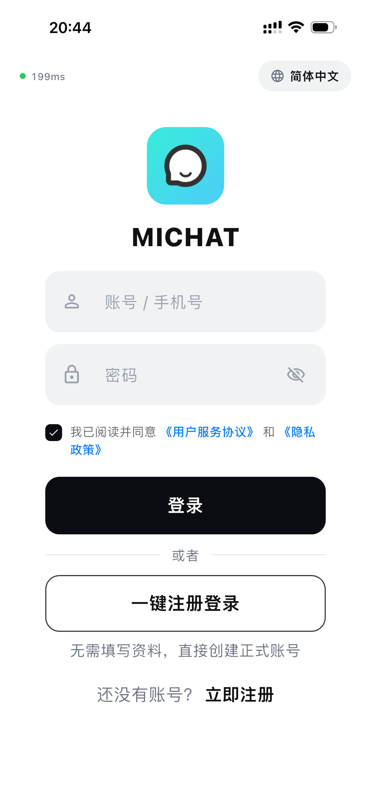<br/><sub>登录</sub></td>
    <td align="center">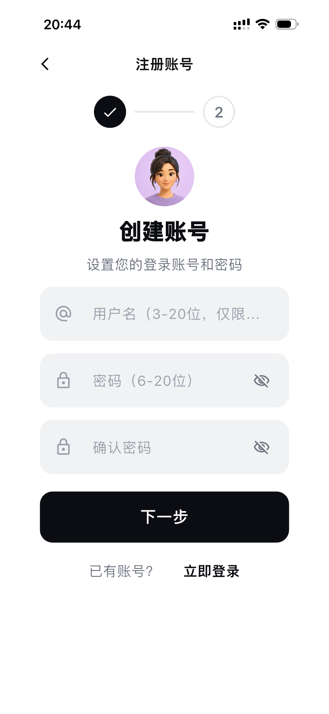<br/><sub>注册</sub></td>
    <td align="center">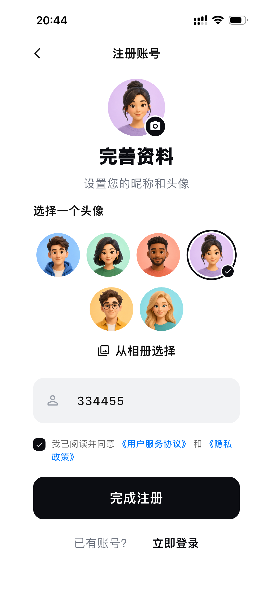<br/><sub>注册二</sub></td>
  </tr>
  <tr>
    <td align="center">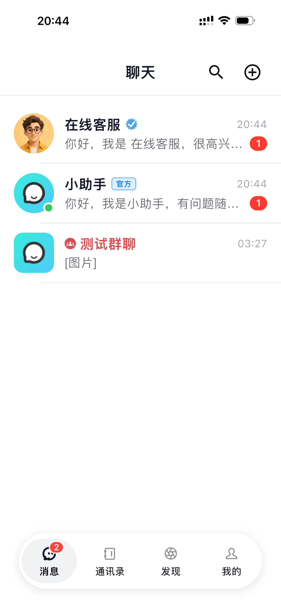<br/><sub>消息列表</sub></td>
    <td align="center">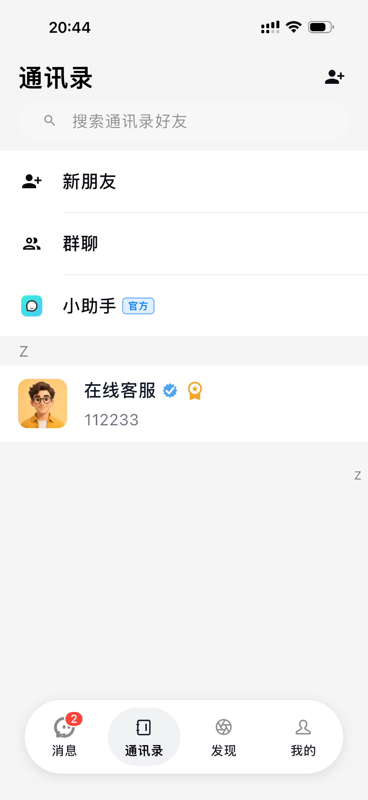<br/><sub>通讯录</sub></td>
    <td align="center">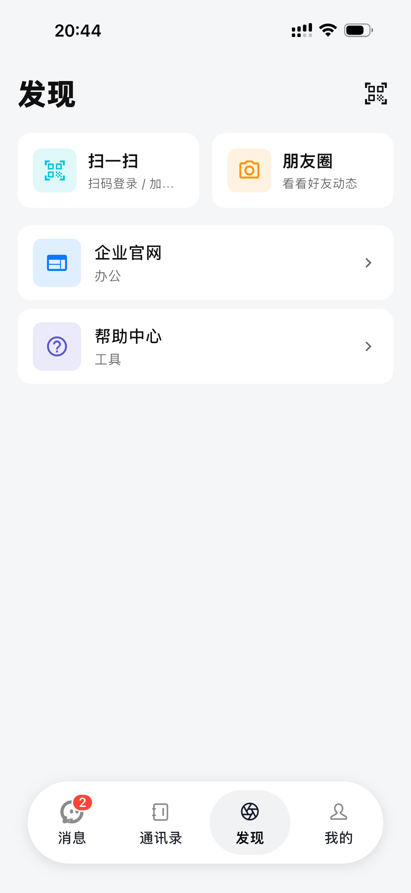<br/><sub>发现</sub></td>
  </tr>
  <tr>
    <td align="center"><br/><sub>音视频通话</sub></td>
    <td align="center">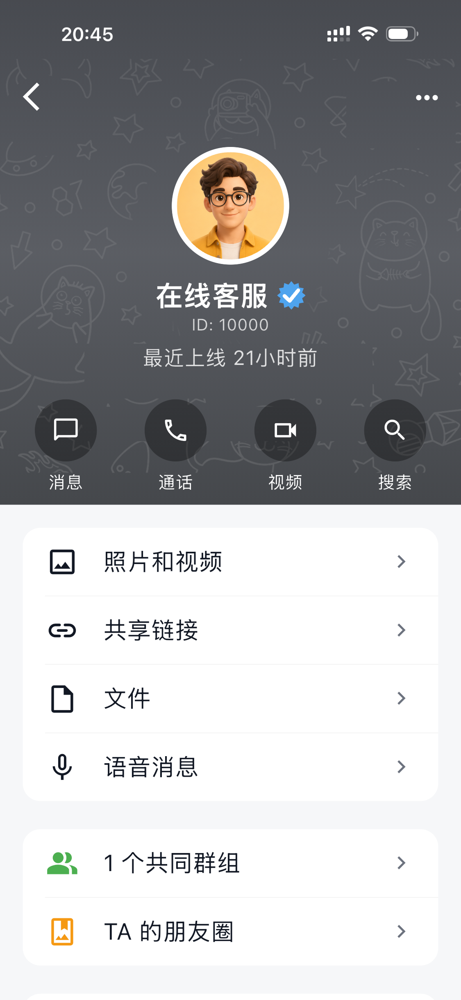<br/><sub>资料 / 二维码名片</sub></td>
    <td align="center">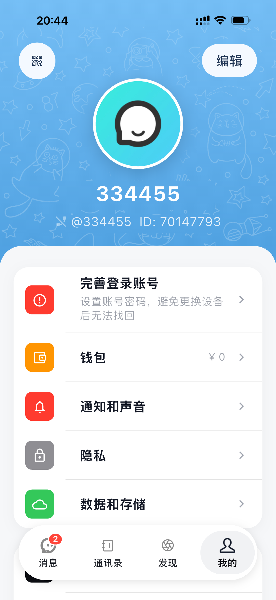<br/><sub>用户中心</sub></td>
  </tr>
  <tr>
    <td align="center"><br/><sub>深色模式</sub></td>
    <td align="center">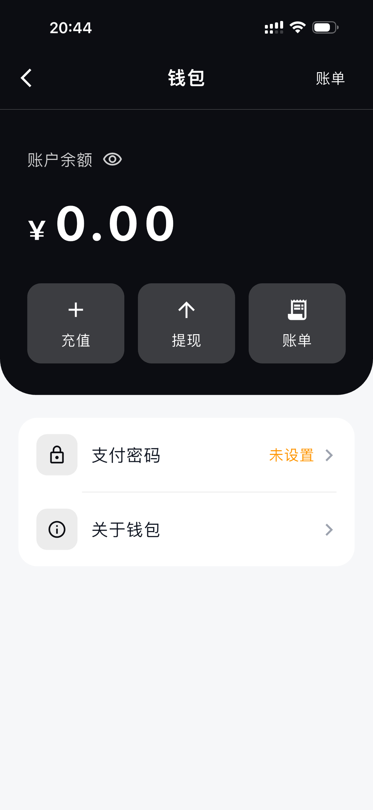<br/><sub>多语言切换</sub></td>
    <td align="center">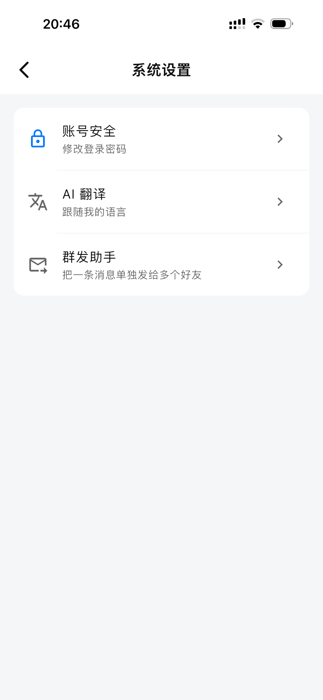<br/><sub>更多功能</sub></td>
  </tr>
</table>

### PC 桌面端

<table>
  <tr>
    <td align="center"><br/><sub>PC 端单聊主界面</sub></td>
    <td align="center">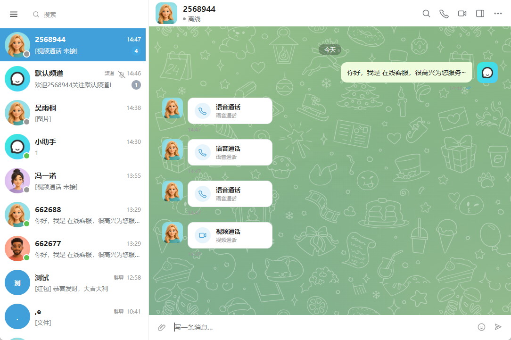<br/><sub>PC 端群聊 / 群管理</sub></td>
  </tr>
  <tr>
    <td align="center">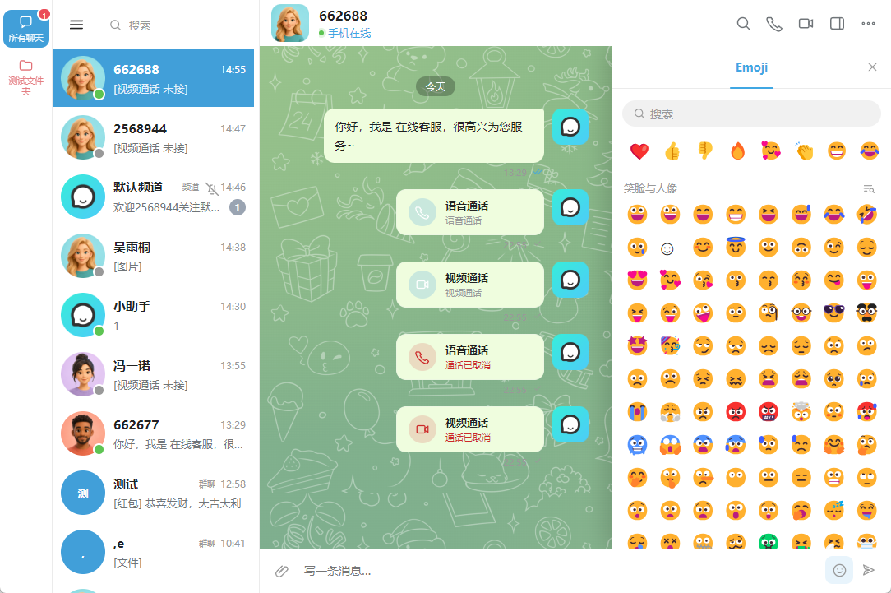<br/><sub>PC 端音视频通话</sub></td>
    <td align="center">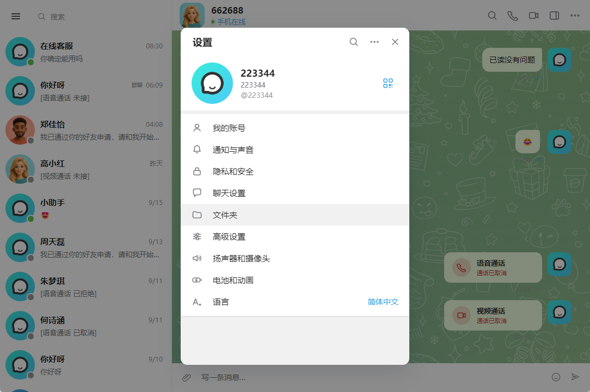<br/><sub>PC 端通讯录 / 好友申请</sub></td>
  </tr>
  <tr>
    <td align="center">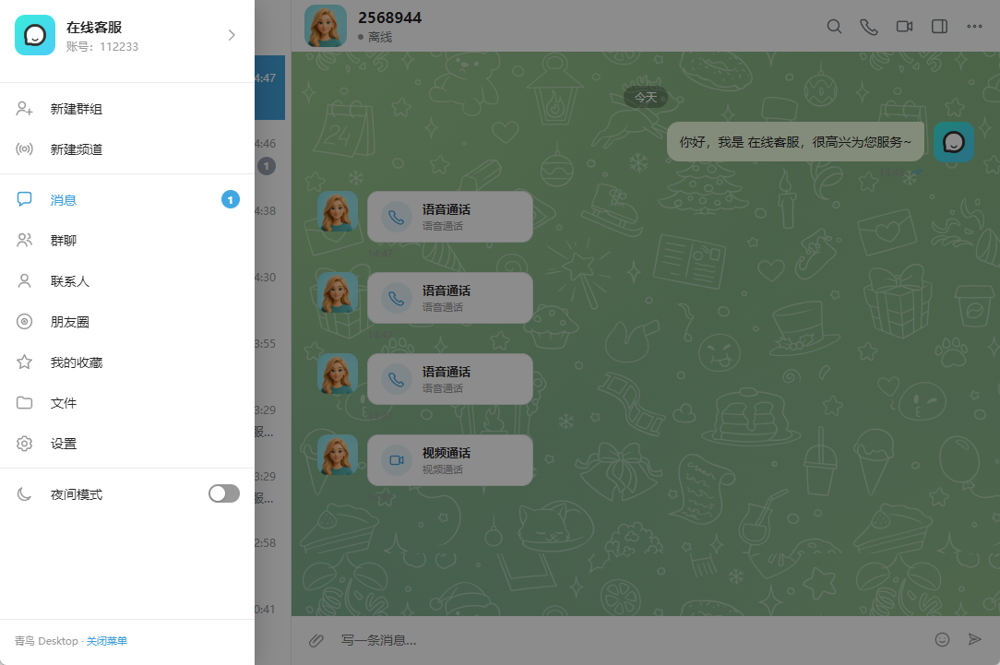<br/><sub>PC 端朋友圈</sub></td>
    <td align="center">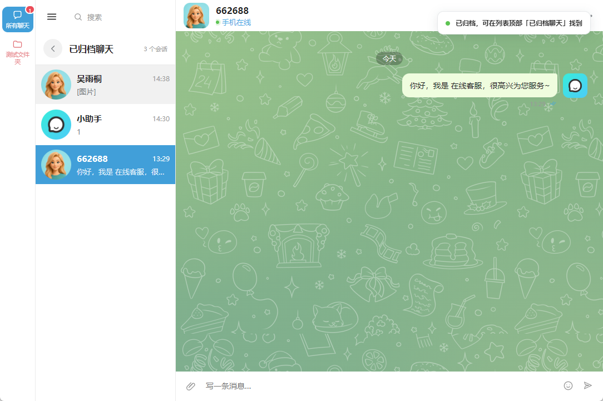<br/><sub>PC 端设置 / 通用配置</sub></td>
  </tr>
</table>


---

## ✨ 核心功能

### 💬 消息聊天
- 单聊 / 群聊（支持千人群），消息实时送达
- 支持多种消息类型：文字、图片、视频、语音、文件、名片
- 消息撤回、引用回复、转发、置顶、收藏
- 消息长按快捷菜单（复制 / 引用 / 收藏 / 撤回 / 转发 / 置顶）
- 群公告、@提醒、群成员管理、群二维码
- 聊天记录本地缓存，断网也能查看历史消息

### 👥 好友与社交
- 添加好友：搜索添加 / 扫二维码添加 / 分享名片添加
- 好友验证、备注、拉黑、删除
- 个人二维码名片、ShortID 靓号
- 好友来源标记（搜索 / 扫码 / 名片）

### 💰 钱包支付
- 余额钱包、账单明细
- 红包（单发 / 群红包）、转账、领取与退回
- 服务端金额全额校验，防篡改、防重复领取

### 📹 音视频通话
- 一对一语音 / 视频通话（腾讯云 TRTC）
- 来电铃声、通话中切换摄像头、静音
- PC 端同样支持通话

### 🖼️ 朋友圈
- 发布图文动态、浏览好友动态
- 点赞、评论、删除自己的动态

### 🔔 推送与体验
- 离线消息推送：极光推送 + 小米 / OPPO / vivo / 荣耀厂商通道
- 四语言国际化：简体中文 / 繁体中文 / 英文 / 日文
- 深色模式跟随系统
- 文件与图片存储：MinIO / 阿里云 OSS 对象存储，后台可一键切换

### 🔐 安全与登录
- 新设备登录认证，异地 / 新设备登录二次确认
- JWT 鉴权，接口签名校验
- 后台支持批量新建账号，便于内部团队快速开通

### 🛠️ 管理后台
- 用户管理、会话与群组管理
- 钱包账单查询
- 系统配置：注册方式、群人数上限（0 = 不限）、聊天设置等

---

## 🏗️ 技术栈与架构

| 端 | 技术方案 |
| :--- | :--- |
| **移动端 App** | Flutter（Dart），一套代码支持 Android / iOS / H5；集成音视频通话、极光推送 |
| **uni-app 端** | uni-app（Vue），一套代码编译到各家小程序 |
| **PC 电脑端** | Vue3 + Electron，可打包 Windows exe 安装包（窗口 / 代理 / 多开等配置化） |
| **管理后台** | Vue3 + Element Plus（im-web） |
| **服务端** | Go 单体（Gin + GORM + WebSocket），模块：`API 服务` gin:8080 业务接口 · `WS 网关` :9090 长连接推送 · `im-convert` 文档转 PDF 微服务 |
| **数据存储** | MySQL（业务数据）· Redis（缓存 · 在线状态）· MinIO / OSS（对象存储，后台可切换） |
| **接入层** | Nginx 反向代理 + 四端静态站点 |
| **第三方服务** | 极光推送 / 个推（离线推送 · 厂商通道）、腾讯云 TRTC（音视频通话）、对象存储（MinIO / 阿里云 OSS） |

<div align="center">
  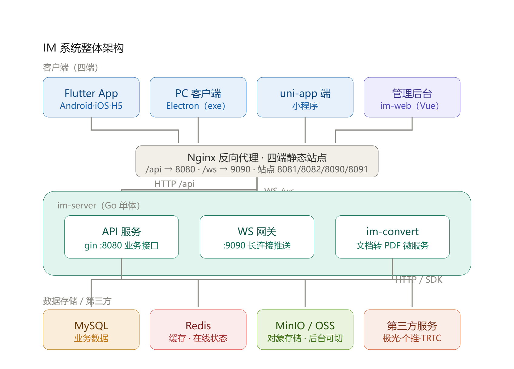
</div>

<details>
<summary><b>🔌 端口与路由规划（点击展开）</b></summary>

```text
Nginx
├── /api   →  127.0.0.1:8080     # im-server API 服务
├── /ws    →  127.0.0.1:9090     # im-server WS 网关（长连接）
├── 8081   →  PC 端静态站点
├── 8082   →  管理后台静态站点
├── 8090   →  H5 / Web 端静态站点
└── 8091   →  官网静态站点
```

> ⚠️ 以上端口为默认规划，实际部署请以《部署文档》与 Nginx 配置为准。

</details>

---

## 🚀 快速开始

### 环境要求

| 组件 | 版本要求 |
| :--- | :--- |
| Go | 1.20+ |
| Flutter | 3.x（Dart 3） |
| Node.js | 18+ |
| MySQL | 5.7+ |
| Redis | 5.0+ |

服务器建议 **2 核 4G 起步**（CentOS / Ubuntu 均可）。

> 需自行申请 [腾讯云 TRTC](https://cloud.tencent.com/product/trtc)（音视频）、[极光推送](https://www.jiguang.cn/) / 个推（离线推送）、[阿里云 OSS](https://www.aliyun.com/product/oss) 或自建 MinIO（对象存储）等第三方服务账号，均有免费额度。

### 1. 启动服务端

```bash
cd im-server
cp .env.example .env    # 修改数据库、Redis、OSS、音视频、推送等配置

# 编译 api 服务
GOOS=linux GOARCH=amd64 CGO_ENABLED=0 go build -o bin/api ./cmd/api

# 编译 gateway 服务
GOOS=linux GOARCH=amd64 CGO_ENABLED=0 go build -o bin/gateway ./cmd/gateway
```

Windows（PowerShell）下编译：

```powershell
$env:GOOS="linux"; $env:GOARCH="amd64"; $env:CGO_ENABLED="0"; go build -o bin/api ./cmd/api
$env:GOOS="linux"; $env:GOARCH="amd64"; $env:CGO_ENABLED="0"; go build -o bin/gateway ./cmd/gateway
```

### 2. 启动管理后台

```bash
cd im-web
npm install
npm run dev
```

### 3. 启动 PC 桌面端

```bash
cd pc
npm install
npm run dev        # 开发模式
npm run build      # 构建前端资源
npm run dist       # 打包 Windows exe 安装包
```

### 4. 运行移动端 App

```bash
cd im-app
flutter pub get
flutter run
```

> 详细的编译、打包与上线步骤请参考随源码附赠的《部署文档》；接口参数与错误码请参考《接口文档》。

---

## 📂 目录结构

```text
.
├── im-app/         # Flutter 移动端（Android / iOS / H5）
├── im-server/      # Go 服务端（api + gateway，Gin + GORM + WebSocket）
├── im-convert/     # 文档转 PDF 微服务
├── pc/             # Vue3 + Electron 桌面端
├── im-web/         # Vue3 + Element Plus 管理后台
├── uniapp/         # uni-app 小程序端
└── doc/            # 截图与文档
```

---

## 🎯 适用场景

- 企业内部通讯、办公协同、私有化聊天工具
- 社交类 App 创业项目快速起步（省去从零开发）
- 客服系统、社群运营工具、行业定制通讯需求
- 学习研究高并发 IM 架构（Go + WebSocket + Flutter 完整实践）

---

## 🗓️ 更新日志

| 日期 | 端 | 更新内容 |
| :--- | :--- | :--- |
| 2026-09-25 | App + PC + 后台 | 新设备登录认证 / MinIO·OSS 对象存储 / 后台批量新建账号 / 腾讯云 TRTC 音视频通话 |
| 2026-09-20 | 全端 | uni-app 小程序端、im-convert 文档转 PDF 微服务上线；Nginx 统一反向代理四端站点 |
| 2026-09-08 | App + PC | 消息转发：长按 / 右键消息可转发给好友或群 |
| 2026-09-08 | App + PC | 个人名片：一键转发名片，对方点开可查看资料并申请加好友；好友来源标记 |
| 2026-09-08 | App | 长按消息「炸开」式快捷菜单：原位还原 + 模糊遮罩 + 操作菜单 |
| 2026-09-08 | App + 后台 | 群聊人数上限后台可配置（0 = 不限），建群 / 拉人 / 扫码入群全链路校验 |
| 2026-09-08 | App + PC | 会话列表预览优化：语音 / 视频 / 名片 / 系统消息显示统一标签 |
| 2026-09-07 | 后台 | 用户资料接口安全加固 |
| 2026-09-03 | App | 聊天体验优化：本地缓存秒开、弱网重试、贴底滚动修正，新增游客登录 |
| 2026-09-02 | PC | 支持打包 Windows exe；窗口 / 多开 / 代理配置化；修复音视频通话与跨域问题 |
| 2026-08-31 | 服务端 | 钱包资金链路安全加固：金额校验、防重领取、失败原路退回、幂等扣款 |

---

## 📦 交付内容

- 四端全部源码：App / 服务端 / PC 端 / 管理后台
- 《接口文档》：全部接口含参数与错误码说明
- 《部署文档》：环境准备 / 编译打包 / 上线步骤

---

## ❓ 常见问题

<details>
<summary><b>有在线演示可以看吗？</b></summary>

有。请查看文档顶部「在线演示」章节，官网、App、Web 端、PC 端与后台均可直接体验，也提供演示账号。

</details>

<details>
<summary><b>需要自己准备第三方服务账号吗？</b></summary>

需要。音视频通话依赖腾讯云 TRTC，离线推送依赖极光推送 / 个推及厂商通道，文件存储可用阿里云 OSS 或自建 MinIO，均需自行申请（有免费额度），在配置文件中填入对应 Key 即可。

</details>

<details>
<summary><b>可以商用和二次开发吗？</b></summary>

可以。源码无加密、无后门，可自由二次开发并部署到自己的服务器。二次开发部分不在免费售后范围内。

</details>

<details>
<summary><b>服务器配置要求高吗？</b></summary>

2 核 4G 起步即可运行，CentOS / Ubuntu 均可。服务端支持多节点部署，生产环境请根据并发量水平扩容。

</details>

---

## ⚠️ 免责声明

请遵守国家法律法规使用本系统，不得用于任何违法违规用途。上线经营所需的相关资质（如 ICP 备案等）由使用者自行办理。

---

## 📄 License

<!-- 请根据实际情况填写开源协议，如 MIT / Apache-2.0，或声明为商业授权源码 -->
