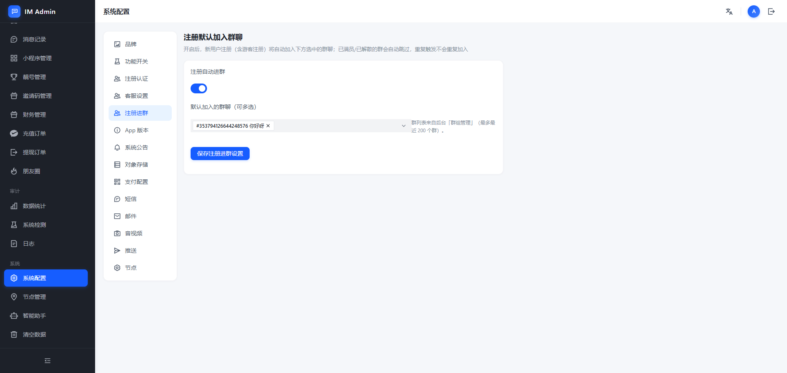
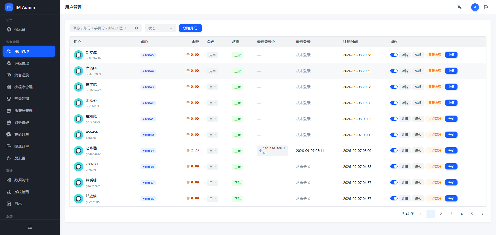
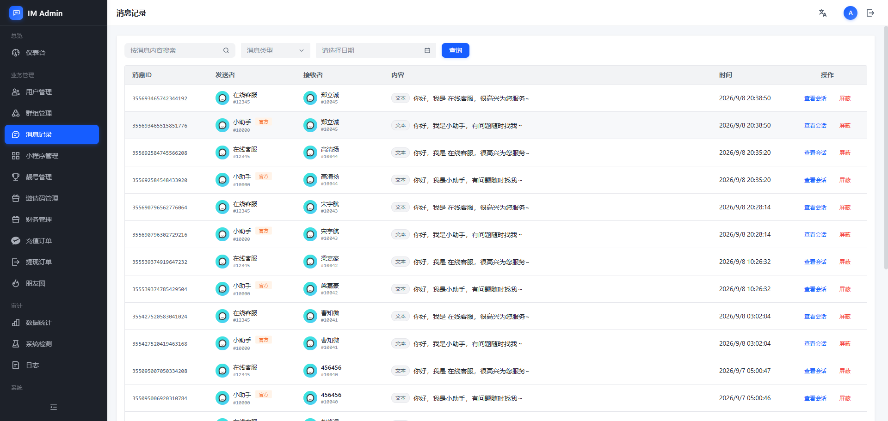
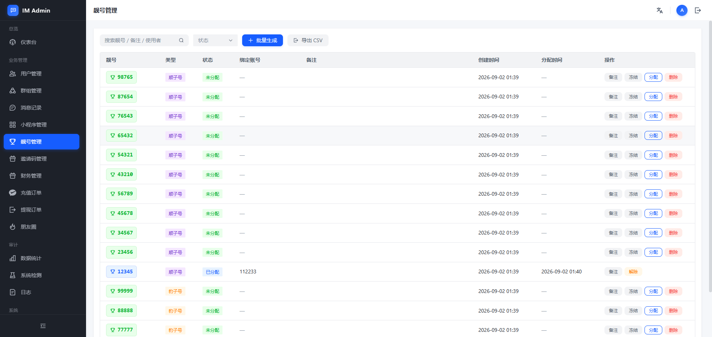

# IM Web Admin · ChatPulse 后台管理系统

基于 Vue 3 + Arco Design 的企业级 IM 后台管理系统，配套 ChatPulse 即时通讯服务端使用。

## 关联项目

ChatPulse 是一套完整的即时通讯解决方案，包含以下仓库：

| 项目 | 说明 | 仓库地址 |
|------|------|----------|
| **im-web** | 后台管理系统（本仓库） | <https://gitee.com/finc123/im-web-admin.git> |
| **im-server** | Go 后端 API + WebSocket 服务 | <https://gitee.com/finc123/goyuyanjishitongxunhouduan.git> |
| **im-pc** | PC 客户端（Vue 3） | <https://gitee.com/finc123/vue-instant-messaging-im.git> |
| **im-mobile** | 移动端 APP（Flutter） | 即将开源 |
| **im-site** | 官网 / 演示站（Nuxt 3） | <https://gitee.com/finc123/chatpulse-site.git> |

> 建议先部署 `im-server`，再启动本后台，最后接入客户端。

## 技术栈

| 类别 | 技术 |
|------|------|
| 框架 | Vue 3.5 + TypeScript |
| 构建 | Vite 5 |
| UI 库 | Arco Design Vue 2.58 |
| 状态管理 | Pinia |
| 路由 | Vue Router 4 |
| HTTP | Axios |
| 国际化 | vue-i18n |

## 快速开始

```bash
# 安装依赖
npm install

# 开发模式 (默认端口 5173)
npm run dev

# 构建生产包
npm run build

# 本地预览
npm run preview
```

### 环境配置

复制 `.env.example` 为 `.env`，修改 API 地址：

```
VITE_API_BASE_URL=http://localhost:8080/api
```

## 功能模块

### 业务管理
- **用户管理** — 用户列表、创建账号、余额/角色/状态管理
- **群组管理** — 群聊创建、成员管理、群消息查看
- **靓号管理** — 批量生成靓号、分配给用户、导出 CSV
- **登录记录** — 用户登录日志追踪
- **小助手管理** — AI 智能助手配置与对话监控
- **邀请码管理** — 注册邀请码生成与使用统计

### 消息管理
- **消息记录** — 全量消息查询、会话内容查看
- **数据清理** — 按时间/类型清理历史数据

### 财务管理
- **充值订单** — 充值流水查询与状态管理
- **提现订单** — 提现申请审核
- **财务数据** — 营收统计与图表

### 系统配置
- **品牌设置** — Logo、名称、描述
- **注册设置** — 注册开关、认证方式、默认进群
- **支付配置** — 支付渠道接入
- **对象存储** — 图片/文件存储配置
- **短信/邮件** — 通知通道配置
- **音视频/推送** — IM 核心服务配置
- **节点管理** — 集群节点监控
- **系统公告** — 全局公告发布

### 运维工具
- **仪表盘** — 核心指标概览
- **日志** — 系统日志查看
- **系统检测** — 健康检查

## 后台截图

### 用户管理


### 系统配置


### 消息记录


### 靓号管理


## 项目结构

```
im-web/
├── index.html
├── package.json
├── vite.config.ts
├── tsconfig.json
├── src/
│   ├── admin-main.ts          # 后台入口
│   ├── App.vue
│   ├── api/                   # API 接口
│   │   ├── http.ts
│   │   ├── auth.ts
│   │   ├── admin.ts
│   │   └── friend.ts
│   ├── stores/                # Pinia 状态
│   │   └── auth.ts
│   ├── views/admin/           # 后台页面
│   │   ├── AdminLayout.vue    # 布局框架
│   │   ├── AdminLogin.vue     # 登录页
│   │   ├── DashboardView.vue # 仪表盘
│   │   ├── UserManage.vue     # 用户管理
│   │   ├── GroupManage.vue    # 群组管理
│   │   ├── VipIdsView.vue     # 靓号管理
│   │   ├── MessageQuery.vue   # 消息记录
│   │   ├── ConfigView.vue     # 系统配置
│   │   ├── FinanceView.vue    # 财务管理
│   │   └── ...
│   ├── styles/theme.css
│   └── i18n/
└── screenshots/                # 后台截图
```

## 默认账号

| 项目 | 值 |
|------|----|
| 用户名 | admin |
| 密码 | admin123 |

## 构建产物

```bash
npm run build
# 输出到 dist/ 目录，部署到 Nginx 等静态服务器
```

Nginx 配置示例：

```nginx
server {
    listen 80;
    server_name admin.example.com;
    root /var/www/im-web/dist;

    location / {
        try_files $uri $uri/ /index.html;
    }

    location /api/ {
        proxy_pass http://127.0.0.1:8080/api/;
    }
}
```
